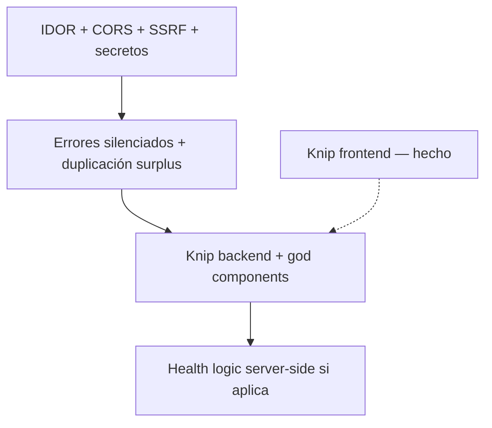

# Auditoría de señales «vibe coding» — Comidas / OptimaFlow

**Fecha:** 2026-05-26  
**Alcance:** `backend/src`, `frontend/src`, `backoffice/src`, Knip, `docs/BACKEND-SECURITY-AUDIT.md`

No es un proyecto caótico: hay capa de servicios, tests, validación Zod, guards por hogar y pre-commit con Gitleaks/Knip. Las señales más graves son de **seguridad y consistencia**, no de «código sin estructura».

Relacionado: [BACKEND-SECURITY-AUDIT.md](./BACKEND-SECURITY-AUDIT.md)

---

## Estado de remediación

| Área | Estado | Notas |
|------|--------|--------|
| Knip frontend | **Hecho** (2026-05-26) | `pnpm knip` sin hallazgos; 238 tests + build OK |
| Knip backend | Pendiente | Exports en `list-accent`, `storage-location-colors`, `validation`, etc. |
| P0 seguridad | Pendiente | IDOR, CORS, SSRF, secretos en compose — ver checklist |
| Errores silenciados | Pendiente | Dashboard, `HouseholdProvider`, rutas públicas |
| God components (>500 líneas) | Pendiente | Sin refactor de tamaño aún |

---

## Resumen por severidad

| Nivel | Qué implica | Cantidad aprox. |
|--------|-------------|------------------|
| **Crítico (P0)** | Explotable o pérdida de datos en producción | 5–6 |
| **Alto (P1)** | Bugs, deriva, deuda que escala rápido | 8–10 |
| **Medio (P2)** | Mantenimiento, duplicación, UX rota en edge cases | Varias |
| **Bajo (P3)** | Limpieza, convenciones, Knip | Muchas |

---

## Crítico — arreglar antes de producción sí o sí

### 1. IDOR en tags y ubicaciones de despensa

| | |
|---|---|
| **Riesgo** | Crítico |
| **Por qué** | `householdGuard` valida el hogar del path, pero `update`/`delete` operan solo por `id` sin comprobar `householdId`. |
| **Ubicación** | `backend/src/services/tag.service.ts`, `backend/src/services/storage-location.service.ts` |

```typescript
// tag.service.ts — patrón actual
async update(tagId: string, input: CreateTagInput) {
  return prisma.tag.update({
    where: { id: tagId },
    data: { name: input.name, color: input.color },
  });
}
```

**Explotación:** Usuario EDITOR en hogar `H_A` envía `PUT /households/H_A/tags/{tagId_de_H_B}` → muta datos de otro hogar.

**Refactor:**

- Pasar `householdId` a todos los métodos mutables.
- `findFirst({ id, householdId })` antes de mutar; si no existe → 404.
- Tests: update/delete con `householdId` incorrecto → sin mutación.

Ya documentado en [BACKEND-SECURITY-AUDIT.md](./BACKEND-SECURITY-AUDIT.md) § P0.1.

---

### 2. CORS abierto si `ALLOWED_ORIGINS` está vacío

| | |
|---|---|
| **Riesgo** | Crítico |
| **Ubicación** | `backend/src/server.ts` |

```typescript
if (!origin || allowedOrigins.length === 0 || allowedOrigins.includes(origin)) {
  cb(null, true);
}
```

**Por qué:** Con lista vacía se acepta cualquier `Origin` (útil en dev, peligroso en prod con JWT en `localStorage`).

**Refactor:**

- En `NODE_ENV=production`, fallar al arrancar si `allowedOrigins.length === 0`.
- Añadir `ALLOWED_ORIGINS` en `docker-compose.prod.yml` (hoy no está definido).

---

### 3. SSRF en importación de recetas por URL

| | |
|---|---|
| **Riesgo** | Crítico |
| **Ubicación** | `backend/src/services/recipe-import.service.ts` |

**Por qué:** Hay blocklist de hostname en HTTPS, pero `fetch` puede seguir redirects a redes internas; no hay resolución DNS→IP ni límite de tamaño de respuesta.

**Refactor:**

- `redirect: 'manual'` y revalidar cada URL de redirect.
- Resolver DNS y rechazar rangos privados/link-local.
- Stream con tope de bytes en el body.
- Rate limit por usuario/hogar en import + Gemini.

**Nota sobre prompts:** Los prompts (`GEMINI_PROMPT`, `KCAL_PROMPT`) están en backend (correcto). El riesgo no es «prompt expuesto al cliente», sino **contenido HTML malicioso inyectado en el prompt** vía URL importada.

---

### 4. Secretos y defaults de despliegue

| | |
|---|---|
| **Riesgo** | Crítico |
| **Ubicación** | `docker-compose.prod.yml`, variables de entorno |

**Problemas en prod compose:**

- `JWT_SECRET: ${JWT_SECRET:-change-this-in-production-please}`
- `POSTGRES_PASSWORD: ${DB_PASSWORD:-comidas_prod_2024}`
- API expuesta en `:3001` sin TLS en el ejemplo
- `VITE_API_URL` con IP hardcodeada
- Faltan `ALLOWED_ORIGINS`, `ADMIN_SECRET`, `GEMINI_API_KEY`

**Refactor:**

- Sin defaults inseguros en producción.
- Secretos solo vía entorno del host o gestor de secretos.
- TLS delante (reverse proxy).
- Rotar claves que hayan vivido en `.env` local (Gitleaks en pre-commit ayuda; asumir exposición si el archivo circuló).

---

### 5. Admin API con secreto estático

| | |
|---|---|
| **Riesgo** | Alto–crítico (según exposición de `:3001`) |
| **Ubicación** | `backend/src/routes/admin.routes.ts` |

`DELETE /admin/users/:id` y rutas similares protegidas solo por `Bearer ${ADMIN_SECRET}`.

**Refactor:** `ADMIN_SECRET` obligatorio, largo, rotación; idealmente admin solo en red interna o detrás de VPN/mTLS.

---

### 6. Rate limit público en memoria

| | |
|---|---|
| **Riesgo** | Alto en multi-réplica |
| **Ubicación** | `backend/src/routes/public.routes.ts` |

`Map` en proceso para `/public/shopping-lists/*` → con varios pods el límite se multiplica; reinicio = reset.

**Refactor:** Redis o rate limit en edge (nginx, Cloudflare).

---

## Alto — problemas típicos de vibe coding con impacto real

### 7. Lógica duplicada frontend ↔ backend

| | |
|---|---|
| **Riesgo** | Alto (deriva silenciosa) |

**Ejemplo:** `computePantrySurplus` idéntico en:

- `frontend/src/utils/pantry-surplus.ts`
- `backend/src/lib/pantry-surplus.ts`

El frontend calcula surplus en UI; el backend al marcar comprado. Si divergen, despensa y lista se desincronizan.

**Refactor:** Una sola fuente de verdad en backend, o paquete `shared/` en el monorepo con tests únicos.

**Otros duplicados conceptuales:**

- Colores de ubicación: `pantry-location-colors` (frontend) vs `storage-location-colors` (backend).
- Flujo de miembros: `MembersModal` + `HouseholdSettingsPage` + `HouseholdMembersSection`.

---

### 8. Lógica de negocio pesada en el frontend

| | |
|---|---|
| **Riesgo** | Alto (salud/nutrición) |

`deficit-planning.ts` (~460 líneas), `health.ts`, `weight-goal-plans.ts` implementan TDEE, déficit, suelos TMB, etc. solo en cliente.

**Por qué:** Si las metas son solo UX local, está bien pero hay que documentarlo. Si son producto serio, hace falta validación server-side equivalente.

**Refactor:** Endpoint + `health-goal.service` con las mismas reglas y tests, o declarar explícitamente que es orientativo y no persistido como verdad clínica.

---

### 9. Errores silenciados

No hay try/catch vacíos en `src`, pero sí el mismo efecto con `.catch(() => …)`:

| Ubicación | Patrón |
|-----------|--------|
| `frontend/src/pages/DashboardPage.tsx` | `.catch(() => {})` al cargar recetas/comidas del día |
| `frontend/src/components/RecipePicker.tsx` | `.catch(() => {})` |
| `frontend/src/pages/RecipesPage.tsx`, `CreateRecipePage.tsx` | `.catch(() => {})` |
| `frontend/src/providers/HouseholdProvider.tsx` | `.catch(() => setHousehold(null))` — oculta error de red |
| `backend/src/services/shopping-list.service.ts` | `Promise.all(...).catch(() => {})` en `accentKey` |
| `backend/src/routes/public.routes.ts` | `catch { return 404 }` — mezcla «no existe» con error interno |

**Refactor:** Helper de error en cliente (toast + log); en backend logger + códigos distintos; no silenciar flujos críticos.

---

### 10. Componentes y páginas gigantes (>500 líneas)

Rompe la regla del proyecto (máx. 500 líneas/archivo en `CLAUDE.md`).

| Archivo | Líneas aprox. |
|---------|----------------|
| `frontend/src/components/RecipeForm.tsx` | 536 |
| `frontend/src/components/WeeklyCalendar.tsx` | 485 |
| `frontend/src/pages/HouseholdSettingsPage.tsx` | 476 |
| `frontend/src/pages/HealthPage.tsx` | 461 |
| `frontend/src/utils/deficit-planning.ts` | 460 |
| `frontend/src/pages/PantryPage.tsx` | 436 |
| `backend/src/services/recipe-import.service.ts` | 411 |

**Por qué:** Fetch + estado + UI + reglas en un solo archivo.

**Refactor:** Hooks (`useHouseholdSettings`, `usePantryForm`), contenedores por sección, servicios puros testeados.

**Caos menor:** `PantryPage.tsx` tiene un `import type` después de constantes — señal de edición incremental.

---

### 11. Código muerto (Knip)

| | |
|---|---|
| **Riesgo** | Medio–alto (confusión, PRs que reintroducen basura) |
| **Estado frontend** | **Resuelto** (2026-05-26) |
| **Estado backend** | Pendiente |

#### Frontend — limpieza aplicada (2026-05-26)

**Archivos eliminados:**

| Archivo | Motivo |
|---------|--------|
| `components/meal-plan/DuplicateDayModal.tsx` | Sin imports en el proyecto |
| `components/ui/SectionOverviewPanel.tsx` | Sin imports |
| `components/ui/SectionPageHeader.tsx` | Sin imports |
| `utils/weight-loss-guidelines.ts` | Sin imports |

**Exports / código retirado (resumen):**

- **Iconos** en `components/ui/Icons.tsx`: `XIcon`, `PlusIcon`, `SearchIcon`, `LinkIcon`, `ExclamationIcon`, `ClipboardIcon`, `MapPinIcon`, `SnowflakeIcon`, `BoxIcon`, `DumbbellIcon`, `ShoppingBagIcon`, `CheckBadgeIcon`, `EmptyStateIcon`.
- **Utilidades:** `splitPantryGroups`, `applyLocationPlacements` (`pantry-groups.ts`); `accentBadgeStyle` (`color-styles.ts`); `sectionAccentCssVarsFromList` (`section-accent-css.ts`); `mealTypePlanRowAccentStyle` (`meal-type.ts`); `tierForPlan`, `tierColorClass` (`deficit-planning.ts`); tipo `KcalRangeIndex` sin uso.
- **Exports hechos internos** (siguen usándose en su archivo): `APP_PALETTE_HEX_VALUES`, `PANTRY_RANDOM_PASTEL_HEX`, `KCAL_TOLERANCE`, `getKcalTargetRange`, `formatIsoLocal`, `LOSS_DIET_PLANS`, `formatProjectionDate`, `renumberOrdersInColumns`, `getVisiblePantryColumns`, `getStorageLocationIconOption`, tipos en stores (`HealthProfile`, `WeightGoal`, etc.).

**Corrección colateral:** `POSTRE` añadido a `Record<MealType, ReactNode>` en `MonthlyCalendar.tsx` (error de build preexistente al tipar iconos de comida).

**Verificación:**

```bash
cd frontend && pnpm knip   # sin hallazgos
cd frontend && pnpm test   # 238 tests
cd frontend && pnpm build  # OK
```

#### Backend — pendiente (Knip al auditar)

- `isListAccentKey`, `PANTRY_PASTEL_HEX`, `PANTRY_RANDOM_PASTEL_HEX`, `defaultStorageLocationColor` (`lib/storage-location-colors.ts`, `list-accent.ts`)
- `recipeFiltersSchema` (`lib/validation.ts`)
- Varios tipos exportados en servicios (`AuthRateLimit*`, `PantryAdditionResult`, etc.) — revisar si son API interna o basura

**Refactor restante:** Ejecutar `cd backend && pnpm knip` y alinear con la misma política que frontend (borrar, internalizar o excepción en `knip.json`).

---

### 12. Patrones contradictorios

| Convención del proyecto | Realidad |
|-------------------------|----------|
| Rutas finas, lógica en servicios | `admin.routes` y guards llaman `prisma` directo |
| Errores tipados | `favorite.service` usa `Object.assign(err, { statusCode })` + cast en rutas |
| Máx. 500 líneas/archivo | Varios archivos lo superan |
| Tests de servicios, no rutas | IDOR no cubierto en `tag.service` |
| Sin `console.log` en prod | Cumplido en `src` |
| Sin TODO/FIXME peligrosos | Cumplido en `src` |

---

### 13. Hacks temporales

**`backend/src/server.ts` — Content-Length:**

```typescript
// Fix: browser translation extensions modify the body without updating Content-Length
fastify.addHook('preParsing', async (request) => {
  delete (request.headers as Record<string, unknown>)['content-length'];
});
```

Puede afectar proxies que confían en `Content-Length`. Documentar o limitar a `application/json`.

**`frontend/src/api/client.ts` — mensaje de dev en 404:**

Añade texto sobre «puerto 3001 con Docker» — confunde en producción.

---

### 14. IA: parsing frágil de respuestas

| | |
|---|---|
| **Riesgo** | Medio (disponibilidad + coste) |

`JSON.parse` sin try/catch dedicado en `parseGeminiResponse` / `parseKcalResponse` → 500 genérico si el modelo devuelve texto inválido.

**Refactor:** `safeParseModelJson`, reintentos acotados, validación Zod del payload, límites de coste por hogar.

---

### 15. Dependencias

| | |
|---|---|
| **Riesgo** | Bajo–medio |

- **Backend:** conjunto razonable (Fastify, Prisma, Zod, Gemini).
- **Frontend:** muy lean (`react`, `router`, `zustand`) — no hay overengineering de librerías.
- **Ruido:** en frontend se redujo el catálogo de iconos exportados (limpieza 2026-05-26); backend sin revisar aún.

---

## Bajo — buenas señales

- **Knip frontend** sin hallazgos tras limpieza (2026-05-26).
- Sin `console.log` en `backend/src`, `frontend/src`, `backoffice/src`.
- Sin `TODO` / `FIXME` / `HACK` en vuestro `src`.
- Sin `@ts-ignore` / `eslint-disable` en `src`.
- `any` casi solo en tests (`mockPrisma as any`).
- Arquitectura base: `createXService(prisma)`, API factories en frontend, tests Vitest por dominio.
- SSRF parcial ya pensado (`validateUrl`, HTTPS, blocklist).
- JWT: falla en prod si sigue `dev-secret` (`backend/src/plugins/auth.ts`).
- Auditoría previa alineada: [BACKEND-SECURITY-AUDIT.md](./BACKEND-SECURITY-AUDIT.md).

---

## Checklist antes de producción

### Seguridad (bloqueantes)

- [ ] Corregir **IDOR** tags + storage locations + tests
- [ ] **CORS** estricto + `ALLOWED_ORIGINS` en compose prod
- [ ] Endurecer **SSRF** (redirects, DNS, límite de body) + rate limit import/IA
- [ ] **Secretos** sin defaults (`JWT`, DB, `ADMIN_SECRET`, Gemini); rotar claves locales
- [ ] Revisar **exposición** del puerto 3001 y TLS
- [ ] Rate limit **público** distribuido si hay >1 instancia

### Calidad y mantenimiento

- [ ] Dejar de **silenciar** errores en dashboard y `HouseholdProvider`
- [ ] Unificar **`computePantrySurplus`** (y política de salud en backend o solo local)
- [x] Limpieza **Knip frontend** (archivos y exports muertos) — 2026-05-26
- [ ] Limpieza **Knip backend**
- [ ] Partir **páginas >500 líneas** o documentar excepción

---

## Priorización de refactor



---

## Conclusión

El proyecto **no es vibe coding puro**: hay disciplina (tests, Knip, guards, auditoría de seguridad). Lo que más se parece a «generado rápido y olvidado» es:

- Pantallas monolíticas
- `.catch(() => {})` en flujos importantes
- Lógica duplicada FE/BE
- Huecos de seguridad ya listados en `BACKEND-SECURITY-AUDIT.md` que aún no están cerrados en código

**Ya mitigado:** código muerto en frontend (Knip limpio, 4 archivos huérfanos eliminados, decenas de exports recortados).

**Siguiente paso recomendado:** PR con el **P0 de seguridad** (IDOR + CORS + tests); en paralelo o después, `pnpm knip` en backend con la misma limpieza que frontend.
